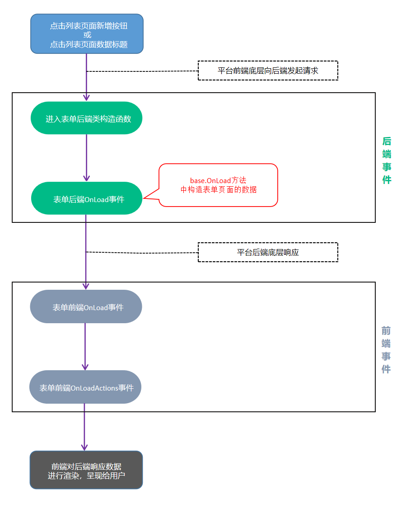

# 表单事件

表单页面中的所有操作，都需要在表单设计页面中编写代码，代码需要编写在各种事件内，当对应操作产生时，系统会自动触发事件，以执行用户的自定义代码。


## 表单前端事件

表单前端共有5个事件：
- ```OnLoad```：加载事件，在后端OnLoad事件执行完后，前端会收到响应数据并渲染表单，渲染完成后触发前端的OnLoad事件
- ```OnLoadActions```：在前端OnLoad事件执行完后，会渲染表单头部按钮，每一个按钮会触发一次前端OnLoadActions事件
- ```OnValidate```：在用户点击表单上的按钮时，会触发前端OnValidate事件，此处可以写代码来校验用户填写的数据，以及给控件赋值，```actionControl.Action``` 的值即按钮编码
- ```BeforeSubmit```：在前端OnValidate事件执行完成后，会触发前端BeforeSubmit事件
- ```AfterSubmit```：在后端OnSubmit事件执行完成后，前端会收到响应数据并触发前端AfterSubmit事件


## 表单后端事件

表单后端共有3个事件，其中初始代码中会有2个事件：```OnLoad``` 和 ```OnSubmit```，还有一个 ```OnWorkflowInstanceStateChanged``` 事件在需要时由开发者自行添加到表单类中。

### 表单后端OnLoad事件

```OnLoad``` 为表单页加载事件，打开表单页时，最开始触发的就是本事件，在触发完后才会到达前端的 ```OnLoad``` 事件。

其中 ```base.OnLoad(response);``` 为默认处理，有以下效果：
1. 内部将当前业务对象转换到 ```response``` 上，以响应给前端渲染

!> 注意：此行代码 ```base.OnLoad(response);``` 请保证触发 ```OnLoad``` 事件时都能得到执行（不要删除该行代码，尽量不要放在if判断体内），否则将失去以上列举的效果。

### 表单后端OnSubmit事件

```OnSubmit``` 在**按钮点击**或**Post请求**时触发，此事件的 ```actionName``` 参数非常重要，标识了触发来源。当按钮点击时，```actionName``` 即按钮编码；当Post请求时，```actionName``` 即前端自定义的请求活动名称。

其中 ```base.OnSubmit(actionName, postValue, response);``` 为默认处理，有以下效果：
1. ```actionName``` 为 ```Save/Submit```（即 暂存/提交/同意）时，内部执行保存当前业务对象的操作（保存至数据库）
2. ```actionName``` 为 ```Submit```（即 提交/同意）时，且导致数据生效，则内部自动触发生效的业务规则
3. ```actionName``` 为 ```Remove```（即 删除）时，且删除的是生效数据，则内部自动触发作废的业务规则
4. 内部根据不同的 ```actionName``` 构造不同的 ```response``` 数据，以响应给前端处理

!> 注意：此行代码 ```base.OnSubmit(actionName, postValue, response);``` 请保证触发 ```OnSubmit``` 事件时都能得到执行（不要删除该行代码，尽量不要放在if判断体内），否则将失去以上列举的效果。


### 表单后端OnWorkflowInstanceStateChanged事件

当流程状态发生改变时，会触发 ```OnWorkflowInstanceStateChanged``` 事件，该事件有两个传入参数：```oldState```、```newState```，所以就能用来判断当前为结束时触发，还是重新激活时触发。关于此事件的说明，请参考此文档[流程结束/重新激活 事件](/doc/workflow?id=流程结束重新激活-事件)


## 表单后端判断各种状态

以下状态判断，可用于表单后端的 ```OnLoad```、```OnSubmit``` 两个事件中。

### 判断当前表单数据的数据状态
``` cs
H3.DataModel.BizObjectStatus boStatus = this.Request.BizObject.Status;
if(boStatus == H3.DataModel.BizObjectStatus.Draft)
{
    //草稿
}
if(boStatus == H3.DataModel.BizObjectStatus.Running)
{
    //流程审批进行中（表单有流程时）
}
if(boStatus == H3.DataModel.BizObjectStatus.Effective)
{
    //生效/流程已结束
}
if(boStatus == H3.DataModel.BizObjectStatus.Canceled)
{
    //作废/取消流程后
}
```

### 判断当前流程节点编码
``` cs
string activityCode = this.Request.ActivityCode;
if(activityCode == "流程节点编码")
{
    //本事件触发于xx流程节点
}
```

### 判断表单模式（只用于OnLoad事件中）
``` cs
H3.SmartForm.SmartFormMode formMode = this.Request.FormMode;
if(formMode == H3.SmartForm.SmartFormMode.Create) 
{
    //通过点击列表页上的新增按钮打开表单时，表单处于Create状态
}
if(formMode == H3.SmartForm.SmartFormMode.Edit) 
{
    //暂存后重新打开表单，表单处于Edit状态
    //流程审批过程打开表单，表单处于Edit状态
    //数据生效后，打开本表单，并且点击了编辑按钮，表单处于Edit状态
}
if(formMode == H3.SmartForm.SmartFormMode.View)
{
    //数据生效后，通过数据标题等方式打开本表单查看数据，表单处于View状态
}
```

### 判断表单是否处于新增模式下
``` cs
if(this.Request.IsCreateMode)
{
    //通过点击列表页上的新增按钮打开表单时，IsCreateMode值为true
}
```

### 判断表单是否在移动端打开
``` cs
if(this.Request.IsMobile)
{
    //在移动端打开表单时，IsMobile值为true
}
```

### 判断当前表单是否开启了流程审批
``` cs
if(this.Request.FormDataType == H3.SmartForm.SmartFormDataType.BizObject)
{
    //表单未开启流程
}
if(this.Request.FormDataType == H3.SmartForm.SmartFormDataType.Workflow)
{
    //表单已开启流程
}
```


## 表单后端常用状态判断组合

### 后端OnSubmit事件中判断点击暂存按钮
``` cs
protected override void OnSubmit(string actionName, H3.SmartForm.SmartFormPostValue postValue, H3.SmartForm.SubmitSmartFormResponse response)
{
    try
    {
        if(actionName == "Save")
        {
            // 业务代码
        }
    } catch(Exception ex)
    {
        response.Errors.Add(ex.Message);
        base.OnSubmit(actionName, postValue, response);
        return;
    }

    base.OnSubmit(actionName, postValue, response);
}
```

### 后端OnSubmit事件中判断流程发起时提交
``` cs
protected override void OnSubmit(string actionName, H3.SmartForm.SmartFormPostValue postValue, H3.SmartForm.SubmitSmartFormResponse response)
{
    try
    {
        //点提交按钮，有三种情况会发起流程，所以三种情况都需判断
        //三种情况分别是：新增提交、先暂存后提交，流程回到发起节点重新提交
        //一般在做销售出库冻结库存时，经常会在流程发起时冻结库存，所以会用到此示例
        if(
            (actionName == "Submit" && this.Request.IsCreateMode) ||
            (actionName == "Submit" && this.Request.BizObject.Status == H3.DataModel.BizObjectStatus.Draft) ||
            (actionName == "Submit" && this.Request.ActivityCode == "Activity2")
        )
        {
            // 业务代码
        }
    } catch(Exception ex)
    {
        response.Errors.Add(ex.Message);
        base.OnSubmit(actionName, postValue, response);
        return;
    }

    base.OnSubmit(actionName, postValue, response);
}
```

### 后端OnSubmit事件中判断某个流程节点下点击同意
``` cs
protected override void OnSubmit(string actionName, H3.SmartForm.SmartFormPostValue postValue, H3.SmartForm.SubmitSmartFormResponse response)
{
    try
    {
        //由于提交和同意按钮的actionName都是Submit，所以判断同意按钮时，需要联合当前流程节点编码进行判断
        if(actionName == "Submit" && this.Request.ActivityCode == "Activity??")
        {
            // 业务代码
        }
    } catch(Exception ex)
    {
        response.Errors.Add(ex.Message);
        base.OnSubmit(actionName, postValue, response);
        return;
    }

    base.OnSubmit(actionName, postValue, response);
}
```

### 后端OnSubmit事件中判断流程进行中点击撤回/不同意
``` cs
protected override void OnSubmit(string actionName, H3.SmartForm.SmartFormPostValue postValue, H3.SmartForm.SubmitSmartFormResponse response)
{
    try
    {
        //一般在做销售出库冻结库存时，经常会在流程发起时冻结库存，而撤回/不同意时回滚库存，所以会用到此示例
        if(this.Request.BizObject.Status == H3.DataModel.BizObjectStatus.Running &&
            (actionName == "RetrieveInstance" || actionName == "Reject")
        )
        {
            // 业务代码
        }
    } catch(Exception ex)
    {
        response.Errors.Add(ex.Message);
        base.OnSubmit(actionName, postValue, response);
        return;
    }

    base.OnSubmit(actionName, postValue, response);
}
```

### 后端OnSubmit事件中判断无流程表单的初始提交
``` cs
protected override void OnSubmit(string actionName, H3.SmartForm.SmartFormPostValue postValue, H3.SmartForm.SubmitSmartFormResponse response)
{
    try
    {
        //由于提交和同意按钮的actionName都是Submit，所以判断提交时需要联合当前表单状态进行判断
        //并且加上表单为无流程表单的判断
        if(actionName == "Submit"
            && this.Request.FormDataType == H3.SmartForm.SmartFormDataType.BizObject 
            && (this.Request.IsCreateMode || this.Request.BizObject.Status == H3.DataModel.BizObjectStatus.Draft))
        {
            // 业务代码
        }
    } catch(Exception ex)
    {
        response.Errors.Add(ex.Message);
        base.OnSubmit(actionName, postValue, response);
        return;
    }

    base.OnSubmit(actionName, postValue, response);
}
```

### 后端OnSubmit事件中判断编辑提交
``` cs
protected override void OnSubmit(string actionName, H3.SmartForm.SmartFormPostValue postValue, H3.SmartForm.SubmitSmartFormResponse response)
{
    try
    {
        //由于提交和同意按钮的actionName都是Submit，所以判断编辑提交时需要联合当前业务对象数据状态进行判断
        if(actionName == "Submit" && this.Request.BizObject.Status == H3.DataModel.BizObjectStatus.Effective)
        {
            // 业务代码
        }
    } catch(Exception ex)
    {
        response.Errors.Add(ex.Message);
        base.OnSubmit(actionName, postValue, response);
        return;
    }

    base.OnSubmit(actionName, postValue, response);
}
```

### 后端OnSubmit事件中判断删除生效数据
``` cs
protected override void OnSubmit(string actionName, H3.SmartForm.SmartFormPostValue postValue, H3.SmartForm.SubmitSmartFormResponse response)
{
    try
    {
        if(actionName == "Remove" && this.Request.BizObject.Status == H3.DataModel.BizObjectStatus.Effective)
        {
            /*
                注意：
                删除时this.Request.BizObject只有系统字段数据，所以一般来说这里需要先通过Load加载完整的表单数据，
                否则通过this.Request.BizObject["控件编码"]取不到值
            */
            this.Request.BizObject.Load();

            // 业务代码

        }
    } catch(Exception ex)
    {
        response.Errors.Add(ex.Message);
        base.OnSubmit(actionName, postValue, response);
        return;
    }

    base.OnSubmit(actionName, postValue, response);
}
```

### 后端OnLoad事件中判断当前用户非管理员时，设置控件隐藏/只读
``` cs
protected override void OnLoad(H3.SmartForm.LoadSmartFormResponse response)
{
    base.OnLoad(response);

    if(this.Request.UserContext.IsAdministrator) 
    {
        //IsAdministrator为true时，表示打开本表单的用户是管理员
    } else
    {
        //非管理员时，将某控件隐藏/只读
        response.ReturnData["控件编码"].Visible = false;//隐藏该控件
        response.ReturnData["控件编码"].Editable = false;//设置该控件只读
    }
}
```

### 后端OnLoad事件中判断当前用户所属部门为某部门时，不允许查看数据
``` cs
protected override void OnLoad(H3.SmartForm.LoadSmartFormResponse response)
{
    //判断当前表单模式为数据查看模式下
    if(this.Request.FormMode == H3.SmartForm.SmartFormMode.View)
    {
        //获取当前用户的部门实例
        H3.Organization.Unit dep = this.Request.Engine.Organization.GetParentUnit(this.Request.UserContext.UserId);
        if(dep.Name == "运营部门")
        {
            throw new Exception("运营部门不允许查看本数据！");
        }
    }

    base.OnLoad(response);
}
```


## 表单页加载时的事件触发顺序图




## 表单按钮点击时的事件触发顺序图

