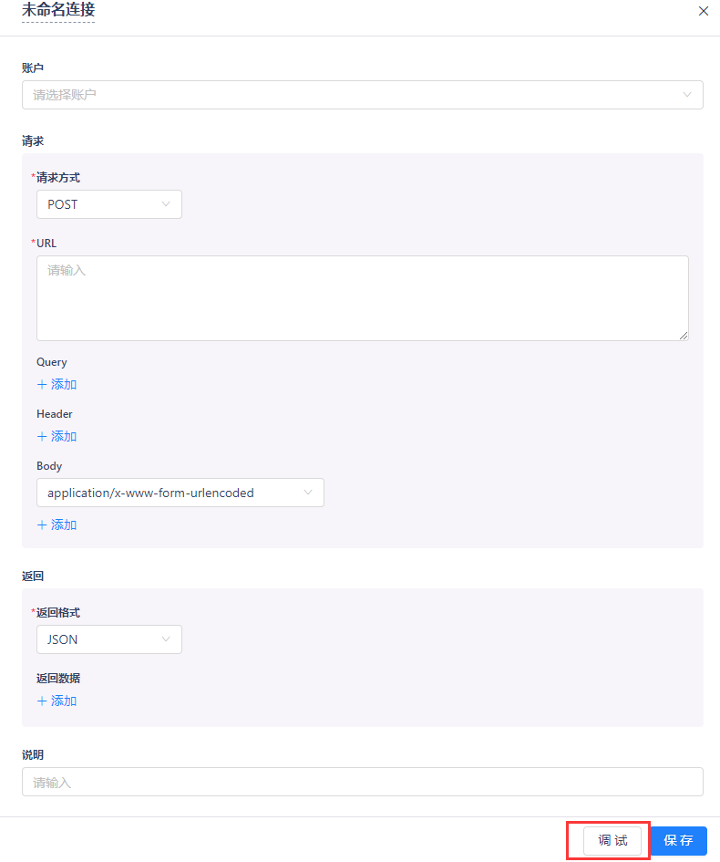

# 氚云调用WebAPI

第三方Api要求：http/https协议，请求参数和响应数据不支持文件类型，且响应数据必须是JSON格式

## 通过非代码的连接调试接口

通过非代码的连接调试一下接口，可以确定接口连通性、响应数据的结构，也可以大概判断一下氚云支不支持直接连接该服务（若不支持可以通过在外部服务器开发并部署一个中间服务来做转接）




## 新建一个第三方连接（代码）

在 **插件中心** 新建连接（注意：编码框内自定义一个该连接的Code，不是填UTF-8、ASCII等数据编码）


!> PS：连接URL最好使用域名的方式，如果使用 IP:Port 方式，端口号可能处于氚云防火墙黑名单中。
如条件受限，只能使用 IP:Port 方式，配置上后，连接请求一直卡死无响应，可以切换到 200-300 范围内的端口试试。


## 代码调用第三方连接示例

<!-- tabs:start -->

#### **响应数据示例**

氚云的接口请求，响应数据一定要为JSON对象格式，下面是调用代码示例中对应响应数据：

``` json
{
  "code": 200,
  "ID": "654028207203",
  "msg": "查询成功，查询花费0.0002秒",
  "data": {
    "Name": "阔克托干村",
    "Longitude": 82.640110,
    "Latitude": 43.755200,
    "Province": "新疆维吾尔自治区",
    "City": "伊犁哈萨克自治州",
    "District": "尼勒克县",
    "Tow": "喀拉托别乡",
    "Villag": "阔克托干村",
    "LevelType": 5,
    "neighbors": [
      {
        "ID": "654028208000",
        "Villag": "胡吉尔台乡",
        "LevelType": 5
      },
      {
        "ID": "654028202000",
        "Villag": "加哈乌拉斯台乡",
        "LevelType": 5
      }
    ],
    "infos": [
      "新疆维吾尔自治区",
      "伊犁哈萨克自治州",
      "尼勒克县",
      "喀拉托别乡",
      "阔克托干村"
    ]
  }
}
```

下面是一些氚云不支持第三方连接响应数据：

1. 非JSON格式的纯文本信息（氚云要求响应数据为JSON格式）
```
请求成功！
```

2. 最外层为数组格式（氚云要求响应数据最外层为对象格式）

``` json
[
  {
    "a": 1
  },
  {
    "a": 2
  }
]
```

3. 文件格式（氚云二次代码开发层面已禁止IO操作相关功能，响应文件给氚云没有意义，若需要传文件给氚云请通过氚云OpenApi上传附件）


#### **调用代码示例**

``` cs
/*
    参照示例的响应JSON结构，会发现响应的JSON有多层（$层、$.data参数层、$.data.neighbors参数层），所以这里需要定义3个H3.BizBus.BizStructureSchema
*/

//定义响应数据最外层的结构体，后续以 $ 表示该层
H3.BizBus.BizStructureSchema structureSchema = new H3.BizBus.BizStructureSchema();
structureSchema.Add(new H3.BizBus.ItemSchema("code", "结果状态码", H3.Data.BizDataType.Int, null));
structureSchema.Add(new H3.BizBus.ItemSchema("ID", "行政区划代码", H3.Data.BizDataType.String, null));
structureSchema.Add(new H3.BizBus.ItemSchema("msg", "描述", H3.Data.BizDataType.String, null));

//定义响应数据的 $.data 属性的结构体
H3.BizBus.BizStructureSchema dataSchema = new H3.BizBus.BizStructureSchema();
dataSchema.Add(new H3.BizBus.ItemSchema("Name", "名称", H3.Data.BizDataType.String, null));
dataSchema.Add(new H3.BizBus.ItemSchema("Longitude", "经度", H3.Data.BizDataType.Double, null));
dataSchema.Add(new H3.BizBus.ItemSchema("Latitude", "纬度", H3.Data.BizDataType.Double, null));
dataSchema.Add(new H3.BizBus.ItemSchema("Province", "省级名称", H3.Data.BizDataType.String, null));
dataSchema.Add(new H3.BizBus.ItemSchema("City", "市级名称", H3.Data.BizDataType.String, null));
dataSchema.Add(new H3.BizBus.ItemSchema("District", "区县名称", H3.Data.BizDataType.String, null));
dataSchema.Add(new H3.BizBus.ItemSchema("Tow", "镇级名称", H3.Data.BizDataType.String, null));
dataSchema.Add(new H3.BizBus.ItemSchema("Villag", "村级名称", H3.Data.BizDataType.String, null));
dataSchema.Add(new H3.BizBus.ItemSchema("LevelType", "层级类型", H3.Data.BizDataType.Int, null));

//定义响应数据的 $.data.neighbors 属性的结构体
H3.BizBus.BizStructureSchema neighborsSchema = new H3.BizBus.BizStructureSchema();
neighborsSchema.Add(new H3.BizBus.ItemSchema("ID", "行政区划代码", H3.Data.BizDataType.String, null));
neighborsSchema.Add(new H3.BizBus.ItemSchema("Villag", "村级名称", H3.Data.BizDataType.String, null));
neighborsSchema.Add(new H3.BizBus.ItemSchema("LevelType", "层级类型", H3.Data.BizDataType.Int, null));
//将 $.data.neighbors 属性的结构体添加进 $.data 的响应数据结构体（注意：neighbors 属性是对象数组格式，类型是H3.Data.BizDataType.BizStructureArray）
dataSchema.Add(new H3.BizBus.ItemSchema("neighbors", "邻村信息数组", H3.Data.BizDataType.BizStructureArray, neighborsSchema));

//将 $.data.infos 属性添加进 $.data 的响应数据结构体（注意：infos 是个字符串数组，但氚云没有对应接收的类型，不过可以用string类型来接收）
dataSchema.Add(new H3.BizBus.ItemSchema("infos", "重要信息数组", H3.Data.BizDataType.String, null));

//将 $.data 属性的结构体添加进最外层的响应数据结构体（注意：data 属性是对象格式，类型是H3.Data.BizDataType.BizStructure）
structureSchema.Add(new H3.BizBus.ItemSchema("data", "地区数据", H3.Data.BizDataType.BizStructure, dataSchema));


//本示例是在表单后端事件中调用，所以H3.IEngine实例可以用this.Engine获取
H3.IEngine engine = this.Engine;

//header 请求参数初始化，此实例会添加到请求的 Headers 中
//注意：请勿给headers设置Content-Type属性，否则可能导致接口调用失败
Dictionary < string, string > headers = new Dictionary<string, string>();

//query 请求参数初始化，此处添加的参数会附加在请求Url后（例：?code=654028207203）
Dictionary < string, string > querys = new Dictionary<string, string>();
querys.Add("code", "654028207203");

//body 请求数据初始化，此键值对数据会转换为JSON对象格式传给第三方接口
Dictionary < string, object > bodys = new Dictionary<string, object>();

//调用Invoke接口，系统底层访问第三方接口的Invoke方法
H3.BizBus.InvokeResult res = engine.BizBus.InvokeApi(
    H3.Organization.User.SystemUserId, //固定值，无需改变
    H3.BizBus.AccessPointType.ThirdConnection, //固定值，无需改变
    "ConnectCode", //连接编码，对应 插件中心 中配置的连接的编码（注意：大小写敏感，必须和第三方连接配置的一样）
    "GET", //请求Method，取值：GET | POST (注意：字母必须全大写，不可大小写混合，仅支持GET | POST两种请求方式)
    "application/x-www-form-urlencoded", //请求Content-Type (注意：传递json数据这里用“application/json”)
    headers, querys, bodys, structureSchema);
if(res == null)
{
    throw new Exception("接口响应数据为空！");
}

if(res.Code != 0) //判断调用是否成功，0代表成功，其他为失败
{
    //调用失败，抛出失败原因
    string resMessage = res.Message;
    throw new Exception("接口调用失败：" + resMessage);
}

//获取返回数据，此实例对应响应JSON的最外层，后续以 $ 表示
H3.BizBus.BizStructure resData = res.Data;

//获取响应数据中的 $.ID 属性值
string ID = resData["ID"] + string.Empty;

//获取响应数据中的 $.data 属性值
H3.BizBus.BizStructure data = (H3.BizBus.BizStructure) resData["data"];
if(data != null)
{
    //获取响应数据中的 $.data.Name 属性值
    string dataName = data["Name"] + string.Empty;
    //获取响应数据中的 $.data.Province 属性值
    string dataProvince = data["Province"] + string.Empty;

    //获取响应数据中的 $.data.neighbors 属性值
    H3.BizBus.BizStructure[] neighbors = (H3.BizBus.BizStructure[]) data["neighbors"];
    if(neighbors != null && neighbors.Length > 0) 
    {
        //获取响应数据中的 $.data.neighbors[0].Villag 属性值
        string firstNeighborVillag = neighbors[0]["Villag"] + string.Empty;

        //循环获取响应数据中的 $.data.neighbors[?].ID 属性值
        foreach(H3.BizBus.BizStructure n in neighbors) 
        {
            string nID = n["ID"] + string.Empty;
        }
    }

    //获取响应数据中的 $.data.infos 属性值（由于 $.data.infos 用string类型来接收的，所以这里会得到infos的JSON字符串）
    string infos_Str = data["infos"] + string.Empty;
    if(!string.IsNullOrWhiteSpace(infos_Str)) 
    {
        //将JSON字符串反序列化得到字符串数组
        string[] infos = this.Deserialize<string[]>(infos_Str);
        if(infos != null && infos.Length > 0)
        {
            //获取响应数据中的 $.data.infos[0] 的值
            string firstInfoValue = infos[0];

            //循环获取  $.data.infos[?] 的值
            for(int i = 0;i < infos.Length; i++)
            {
                string infoValue = infos[i];
            }
        }
    }

}
```

<!-- tabs:end -->